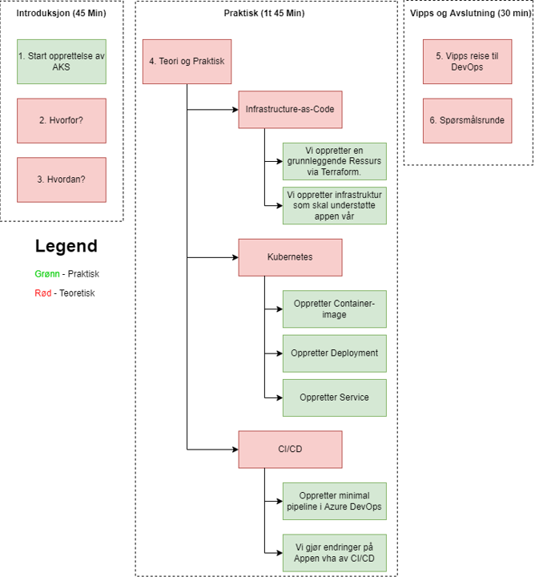
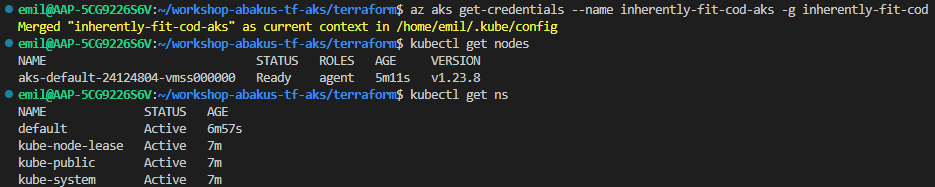
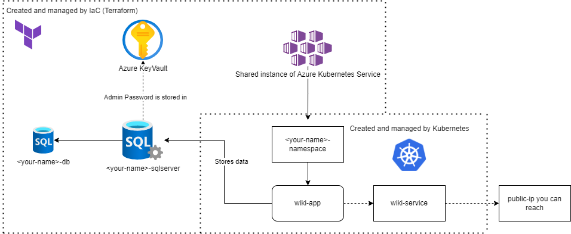

# workshop-abakus-tf-aks

A repository for a workshop given to Abakus.

## Agenda

Følgende er High-Level Agenda



## Prerequisite

* Terraform
* Az CLI
* Code editor
* Git
* kubectl

## Installation guide

All installasjon kan utføres ved å følge følgende prosess:

* Trykk på windows knappen og skriv in Powershell -> Start Windows Powershell
* Installer chocolatey ved å kjøre

  ```iex ((New-Object System.Net.WebClient).DownloadString('https://chocolatey.org/install.ps1'))```
* Installer Vs Code ved å kjøre

    ```choco install vscode -y```
* Installer terraform ved å kjøre

   ```Choco install terraform –version=1.0.0 -y```
* Installer Git ved å kjøre

   ```choco install git.install```

* Installer Kubectl ved å kjøre
  
  ```curl -LO "https://dl.k8s.io/release/v1.25.0/bin/windows/amd64/kubectl.exe"```
  
   Husk deretter å legge kubectl til i PATH slik at du kan bruke kubectl uansett hvor du står i filstrukturen.

* Installer AZ CLI ved å kjøre

  ```Invoke-WebRequest -Uri https://aka.ms/installazurecliwindows -OutFile .\AzureCLI.msi; Start-Process msiexec.exe -Wait -ArgumentList '/I AzureCLI.msi /quiet'; rm .\AzureCLI.msi```

Verifiser at terraform og az cli har blitt installert ved å lukke windows powershell og åpne opp et nytt vindu

* Terraform –version : du skal få ut versjonen av terraform.
* Az –version: du skal få ut versjonen av AZ CLI.

## How to

### Deployer terraform konfigurasjon til subscription

* Naviger til mappen `terraform`
* Log på Azure ved å bruke `az cli`

   ```az login --tenant id --use-device-code```
* Kjør `terraform init`
* Kjør `terraform apply`

Output er navnet på ressursgruppen din.

## Koble til AKS

Etter at AKS et koblet til, benytt følgende kommando for å hente kredentials for bruk mot AKS:

```az aks get-credentials --name MyManagedCluster --resource-group MyResourceGroup```

Derette burde du være i stand til å kjøre kommandor mot AKS vha av kubectl. To enkle tester du kan utføre:

```kubectl get nodes```

```kubectl get ns```

ved å kjøre disse tre i sekvens burde dit output se noenlunde likt ut som dette:



## High Level Design

Følgende Figur er High-Level-Design for oppsettet vi skal lage i denne workshoppen.
Du trenger ikke å forstå denne med en gang, vi skal forklare denne underveis.


