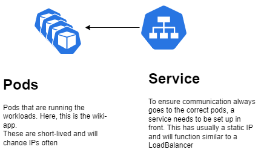
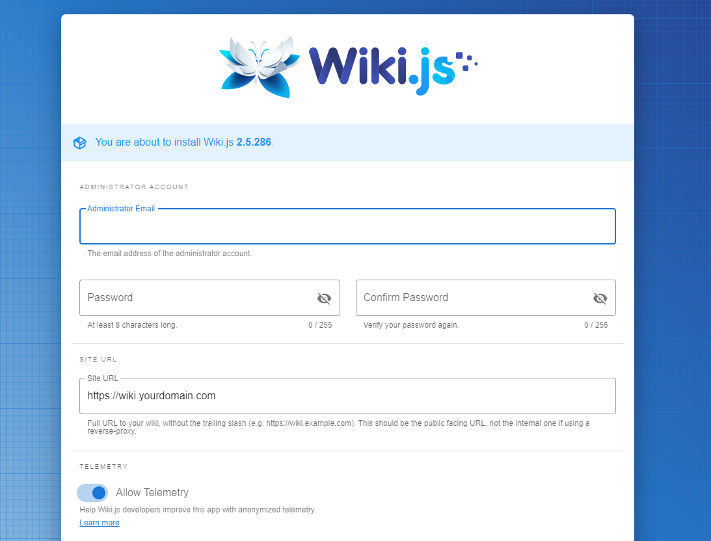
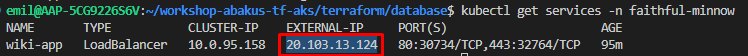

# How to create this app

In this folder there is four files:

* wiki-app-deployment.yaml
* wiki-app-namespace.yaml
* wiki-app-service.yaml
* wiki-app-secret.yaml

You have to adjust these files to match the name (the randomly generated pet) that you have been supplied with. Try not to change anything else than the fields specified.

When this is done perform the following commands in order.

Make sure you are standing inside the directory containing these files.

it is important to apply the namespace first, since this is where the application will be deployed.

First, make sure you have the credentials for the AKS-cluster:

```az aks get-credentials -g terribly-cosmic-tahr -n terribly-cosmic-tahr-aks```

Create the namespace:

```kubectl  apply -f wiki-app-namespace.yaml```

Create the secret:

```kubectl apply -f wiki-app-secret.yaml```

Create the service:

```kubectl apply -f wiki-app-service.yaml```

Create the deployment (and in turn, the pods):

```kubectl apply -f wiki-app-deployment.yaml```

See the following diagram for the relationship between pods and services components:



## Access your application

Now, after having created the application, you should be able to enter the admin-console of wiki.js, like this:



You can retrieve the public IP-address for this by running the following command:
```kubectl -n <your-namespace> get services```

And reading the external-ip field, such as in this screenshot:



Feel free to complete the installation and play around with the app!
