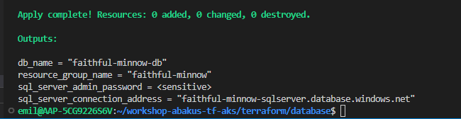

# About the Database

We are going to run an Azure SQL Server with an attached Database.
This is supposed to be where the wiki-application stores its data during use.

This storage is persistent, and is separate from the Kubernetes Cluster.

## How to deploy this

The students will deploy this database using the code inside this folder.
In sequence execute the following commands (make sure your terminal is standing inside this folder)

```terraform init```

```terraform plan```

Now, do a review of the plan, before continuing. You will use this to validate that Terraform is indeed planning to create the resources that you want.

```terraform apply```

Terraform plan is run again under the hood, and you will be prompted to enter y for "yes", to accept the changes.

After some waiting, the terraform deploy should be finished.

Take note of the output that you get from this, as it will be used later. It should look somewhat like this:



Now, the instructors will do some verification to make sure everything is in order before continuing on.
